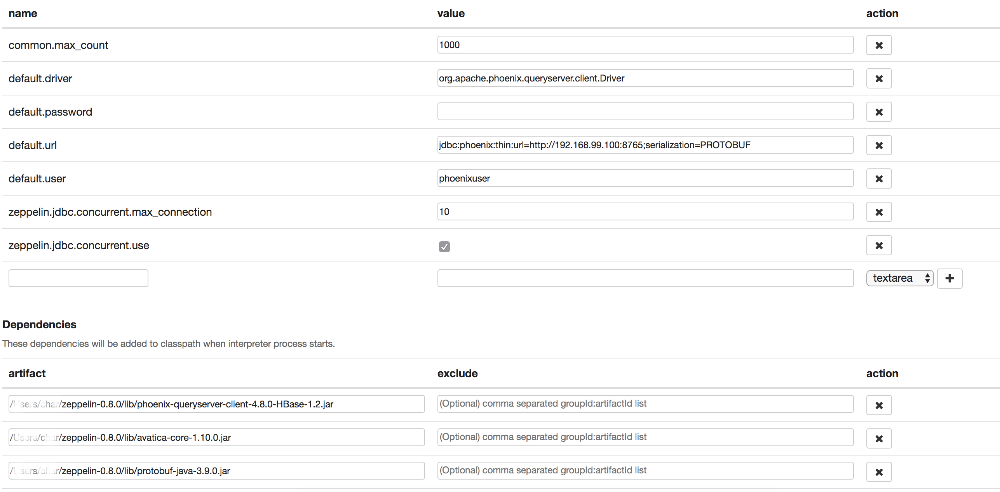

# Docker-Hbase-Phoenix

Docker version for Hbase [1.3.6](https://hbase.apache.org/downloads.html) cluster using Hadoop [2.7.4](https://archive.apache.org/dist/hadoop/common/hadoop-2.7.4/)  

### Services

This version includes Phoenix [4.14.3](https://mvnrepository.com/artifact/org.apache.phoenix/phoenix-server/4.14.3-HBase-1.3) connected to
cluster through Zookeeper 3.4.10  

### Queryserver

The Phoenix queryserver allows to query HBase using the [python-phoenixdb](https://python-phoenixdb.readthedocs.io/en/latest/) driver
to easily send SQL queries and fetch data to the python side.  

### Detail

This cluster uses [HDFS](https://hadoop.apache.org/docs/r2.7.4/hadoop-project-dist/hadoop-hdfs/HdfsDesign.html) to store data in a distributed environment.  

  - Hbase [Architecture](https://mapr.com/blog/in-depth-look-hbase-architecture/)
  - Hbase [reference](http://hbase.apache.org/book.html)
  
  - Python Phoenix [Driver](https://phoenix.apache.org/python.html)  


## Docker Images

  - Hbase Region Server [Image](https://hub.docker.com/r/bde2020/hbase-regionserver/dockerfile)  
  - Hbase Master Server [Image](https://hub.docker.com/r/bde2020/hbase-master/dockerfile)  
  - Docker Apache Phonix [Repo](https://github.com/smizy/docker-apache-phoenix) (To use with Python)
  - Zookeer Docker Image [configuration flags](https://hub.docker.com/_/zookeeper)  


## Standalone

This configuration has **no support** for Phoenix  

To run standalone hbase:
```bash
docker-compose -f docker-compose-standalone.yml up -d
```
The deployment is the same as in [quickstart HBase documentation](https://hbase.apache.org/book.html#quickstart).
Can be used for testing/development, connected to Hadoop cluster.


## Local distributed

Steps to run a local distributed Hbase cluster with a Phoenix service  

### Requisites

Build the base version of Hbase 1.3.6  
This image will serve to launch hbase-master and hbase-regionserver containers  
```bash
cd base
docker build -t hbase-1.3.6 .
```

Once the base HBase image is built, proceed to create master and regionserver images:
```bash
cd hmaster
docker build -t hbase-master-1.3.6 .

cd ../hregionserver
docker build -t hbase-regionserver-1.3.6 .
```

Build the Apache Phoenix image for the queryserver  
```bash
cd phoenix
docker build -t phoenix-4.14.1 .
```

### Running

```bash
docker-compose -f docker-compose-distributed-local-with-phoenix.yml up -d
```

This deployment will start Zookeeper, HMaster and HRegionserver in separate containers.


## Distributed
To run distributed hbase on docker swarm see this [doc](./distributed/README.md)


## Zeppelin

Using Zeppelin [0.8.0](https://zeppelin.apache.org/docs/0.8.0/)  
Start Zeppelin and create a Phoenix interpreter pointing to the Phoenix container.  

#### Configuration  

Phoenix Interpreter config:  



Reference:
  - https://zeppelin.apache.org/docs/0.8.0/interpreter/jdbc.html#apache-phoenix


## Troubleshooting

In case to find connection issues among your instances, have a look at:  

  - https://community.cloudera.com/t5/Support-Questions/Phoenix-and-HBase-connection/td-p/183238  
  - http://apache-phoenix-user-list.1124778.n5.nabble.com/Re-error-when-using-apache-phoenix-4-14-0-HBase-1-2-bin-with-hbase-1-2-6-td4698.html  
  - https://issues.apache.org/jira/browse/PHOENIX-1473  
  - https://community.cloudera.com/t5/Support-Questions/Hbase-Connectivity-Fails/td-p/95088  
